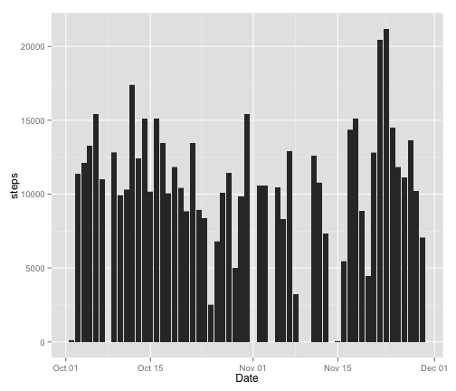
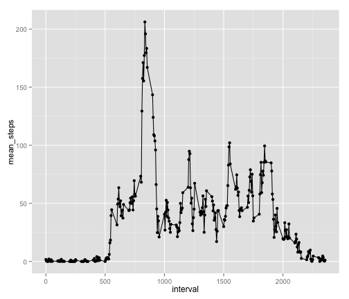
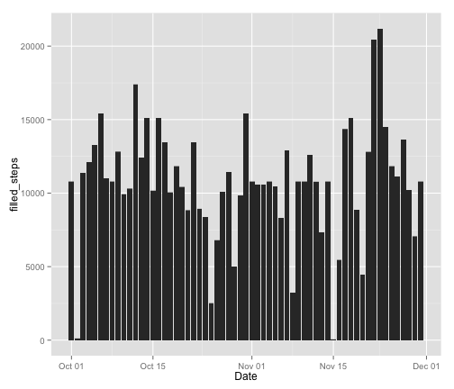
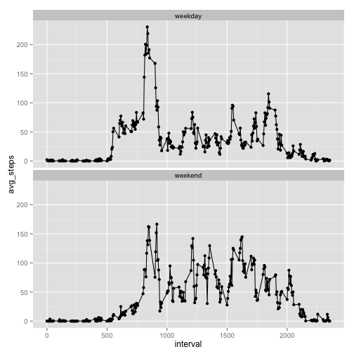

Assignment 1
========================================================
  
**Loading and preprocessing the data**  
- Load data in using *read.csv*   
- Add Date column by converting date string to Date object.  
- Preprocess to get rid of rows that have NA for either interval or steps fields.  

```r
library(knitr)
read.csv(file="/Users/jhua/coursera/activity.csv", header=T, na.strings="NA") -> activity
activity$Date <- strptime(activity$date, "%Y-%m-%d")
na.omit(activity)->cleaned
#activity[complete.cases(activity[,c("steps", "interval")]),]->cleaned
```

**What is mean total number of steps taken per day?**  

Make a histogram of the total number of steps taken each day. 
1. Histogram of the total number of steps taken each day

```r
library(ggplot2)
ggplot(data=cleaned, aes(x=Date, y=steps))+geom_bar(stat="identity")
```

 
  
2. Calculate the mean and median total number of steps taken per day:

```r
library(plyr)
ddply(cleaned, .(Date), summarize, mean_steps=mean(steps), total_steps=sum(steps))->steps_per_day
mean(steps_per_day$total_steps) -> mean_of_totalPerDay
median(steps_per_day$total_steps) -> median_of_totalPerDay
```
  
- **Mean**: 1.0766189 &times; 10<sup>4</sup>  
- **Median**: 10765

**What is the average daily activity pattern?**  
1. Make a time series plot of the 5-minute interval and the average number of steps taken, averaged across all days.  

```r
ddply(cleaned, .(interval), summarize, mean_steps=mean(steps), total_steps=sum(steps))->steps_per_interval
ggplot(data=steps_per_interval, aes(x=interval, y=mean_steps)) + geom_line() + geom_point()
```

 
2. Which 5-minute interval, on average across all the days in the dataset, contains the maxmum number of steps?  

```r
steps_per_interval[steps_per_interval$mean_steps==max(steps_per_interval$mean_steps),c("interval")]->max_interval
```
The 5-minute interval, on average across all the days in the dataset, contains the maxmum number of steps is: 835 with value 206.1698113  

**Imputing missing values**    

```r
nrow(activity[is.na(activity),])->missed_count
missed_count
```

```
## [1] 2304
```
1. Total number of missing values in the dataset (the total number of rows with NA s) is: 2304  
2. Filling in all of the missing values in the dataset by replacing NA with interval average.  

```r
merge(steps_per_interval, activity, by="interval", all.y=T)->m_activity
m_activity$filled_steps<-ifelse(is.na(m_activity$steps), m_activity$mean_steps, m_activity$steps) 
```
3. Create a new dataset filled_activity that is equal to the original dataset but with the missing data filled in.  

```r
filled_activity<-m_activity[,c("filled_steps", "date", "interval", "Date")]
summary(filled_activity)
```

```
##   filled_steps            date          interval           Date           
##  Min.   :  0.00   2012-10-01:  288   Min.   :   0.0   Min.   :2012-10-01  
##  1st Qu.:  0.00   2012-10-02:  288   1st Qu.: 588.8   1st Qu.:2012-10-16  
##  Median :  0.00   2012-10-03:  288   Median :1177.5   Median :2012-10-31  
##  Mean   : 37.38   2012-10-04:  288   Mean   :1177.5   Mean   :2012-10-31  
##  3rd Qu.: 27.00   2012-10-05:  288   3rd Qu.:1766.2   3rd Qu.:2012-11-15  
##  Max.   :806.00   2012-10-06:  288   Max.   :2355.0   Max.   :2012-11-30  
##                   (Other)   :15840
```

```r
nrow(filled_activity[is.na(filled_activity),]) -> check
check
```

```
## [1] 0
```
4. Make a histogram of the total number of steps taken each day and calculate and report the mean and median total number of steps taken per day.

```r
ggplot(data=filled_activity, aes(x=Date, y=filled_steps))+geom_bar(stat="identity")
```

 

```r
ddply(filled_activity, .(Date), summarize, mean_steps=mean(filled_steps), total_steps=sum(filled_steps))->filled_steps_per_day
mean(filled_steps_per_day$total_steps) -> filled_mean_of_totalPerDay
median(filled_steps_per_day$total_steps) -> filled_median_of_totalPerDay
```
  
From the histogram we can see that the values of mean and median total number of steps taken per day is similar as the first part of the assignment. Filling imputing data gives a complete picture of the data. When training model, this will help improve the model since there are more labeled samples.  
- **Mean**: 1.0766189 &times; 10<sup>4</sup>    
- **Median**: 1.0766189 &times; 10<sup>4</sup>  

**Are there differences in activity patterns between weekdays and weekends?**  
1. Create a new factor variable *wlevel* in the dataset with two levels - "weekday" and "weekend" indicating whether a given date is a weekday or weekend day.  

```r
filled_activity$wd<-weekdays(filled_activity$Date)
filled_activity$wlevel<-as.factor(ifelse(filled_activity$wd %in% c("Saturday","Sunday"), "weekend", "weekday"))
```
  
2. Make a panel plot containing a time series plot of the 5-minute interval (x-axis) and the average number of steps taken, averaged across all weekday days or weekend days (y-axis).   
  

```r
ddply(filled_activity, c("wlevel", "interval"), summarise, avg_steps=mean(filled_steps)) -> wlevel_activity
ggplot(wlevel_activity, aes(x=interval, y=avg_steps)) + geom_point() + geom_line() + facet_wrap(~wlevel, nrow=2)
```

 
  
As the plots show, the activity patterns are different from weekday and weekend.  The person is more active on weekend days when comparing with weekdays.


